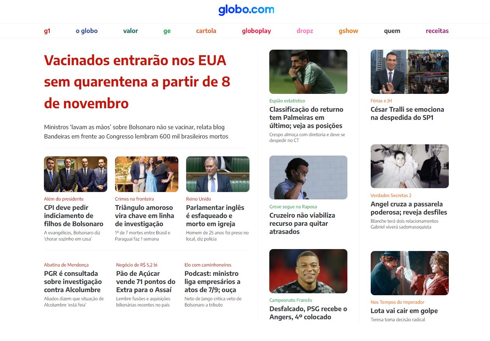

<h1 align="center">Projeto clone do globo.com </h1>

###

  
  
          
  
                                     

## Documentos utilizados:

[Figma](https://www.figma.com/file/Vz3v41ZNYoN0eNDGkDJBwh/Projeto-Globo.com-(Copy)?t=iOb9rBoOgYz8Rgae-0)
___
## Contato

Feito por [Raissa Curty](https://github.com/curtyraissa)!

&nbsp;